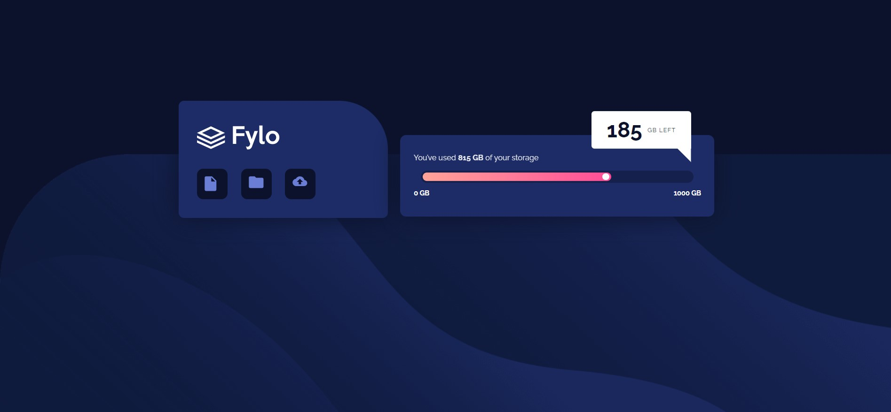

# Frontend Mentor - Fylo data storage component solution

This is a solution to the [Fylo data storage component challenge on Frontend Mentor](https://www.frontendmentor.io/challenges/fylo-data-storage-component-1dZPRbV5n). Frontend Mentor challenges help you improve your coding skills by building realistic projects. 

### The challenge

Users should be able to:

- View the optimal layout for the site depending on their device's screen size

### Screenshot

### Links

- Solution URL: [Add solution URL here](https://your-solution-url.com)
- Live Site URL: [Add live site URL here](https://your-live-site-url.com)

## Author

- Frontend Mentor - [@scorpiojk](https://www.frontendmentor.io/profile/scorpiojk)
- Twitter - [@JoseProgram](https://www.twitter.com/JoseProgram)

## Acknowledgments

In this challenge I started styling in mobile first, this made me the workflow different but not imposible and I liked it. Finally the global classes help me a lot to make faster code.
And last but not less important the manipulation of SVG and PATHS that not was easy work.
